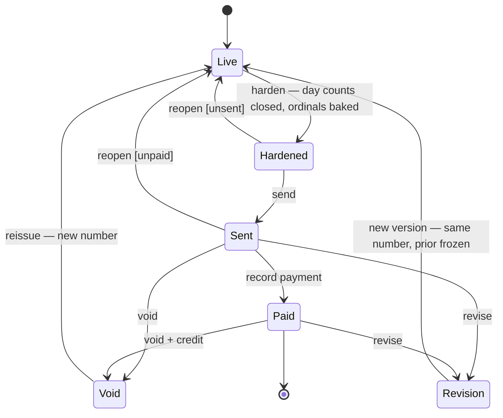

# FieldKit Design Addendum — The Reconciliation Framework
### A standing lens for every feature: what happens when the record and reality disagree

*This is a cross-cutting design principle, not a single feature. It applies to every
module in FieldKit and should be consulted whenever a new feature is designed. The
invoice lifecycle below is its first fully-worked example; future features should be
checked against the four patterns before any route is written.*

---

## The core idea

Every record in FieldKit is a **claim about the physical world** — a machine was
placed, a job was done, an invoice reached an adjuster, a payment cleared. The
software's happy path assumes those claims arrive correctly, in order, and once.
Reality does not cooperate. Techs forget buttons, the office sends the wrong number,
an insurer bounces an invoice back, someone fat-fingers a date.

So the real design question for **any** feature is not "how does the happy path work."
It is:

> **What happens when the record and reality disagree, and how do we let a human
> reconcile them without lying about history?**

A feature that has no answer to that question has a design hole, not an edge case.

---

## The universal test

Before writing a route for any new feature, ask:

> **If a human did this wrong, forgot it, or the world changed after we recorded it —
> what is the recovery path, and does it preserve honest history?**

"Preserve honest history" is the non-negotiable half. Recovery must never overwrite the
past in place; it either supersedes with a retained prior version, or it records *both*
when a thing became true of the world and when we learned it.

---

## The four reconciliation patterns

Every reconciliation problem in the system resolves to one (or a fusion) of these four.

### Pattern 1 — Missed capture → backstop + backdated entry
The event happened; the system was never told.

- **Recovery:** a passive backstop reconstructs what it *can* observe, plus a
  retroactive-entry path with a backdated **effective time** distinct from the
  **record time**.
- **Discipline:** store both timestamps. The record must never pretend the office knew
  at 2am when it was actually entered the next morning.
- **FieldKit example:** the after-hours water-extraction flow. The tech forgets the
  "I'm on an extraction" button; the `CLVisit` location trail reconstructs *which
  property, roughly when*; the tech confirms a backdated window the next morning.

### Pattern 2 — Wrong-but-committed → supersede, never mutate
The record was captured but is wrong, and it has already crossed a commitment wall
(sent, filed, paid).

- **Recovery:** void/reissue or revision. The prior version is frozen and retained
  (soft-delete semantics, one-year retention).
- **Discipline:** never edit a committed record in place — your copy and the third
  party's copy would silently diverge.
- **FieldKit example:** the invoice lifecycle (see worked example below). Any function
  that produces something a third party relies on needs its own commitment wall.

### Pattern 3 — Incomplete → forward the gap to the next human who touches it
The system knows a field is missing but **cannot reconstruct it**, because it is not
physically observable — no sensor, no trail.

- **Recovery:** flag the gap and route it to the next natural touchpoint, rather than
  dropping it or nagging the wrong person.
- **Discipline:** the fill-in belongs to the human *positioned to know*, surfaced
  *when they're positioned to know it* — not to whoever happens to open the record.
- **FieldKit example:** after-hours equipment details. The location backstop recovers
  *when and where*, but cannot recover *which machines and how many* — that is not
  observable. So the work order carries an `equipment_incomplete` flag, and the
  follow-up tech (who is going out to check the drying state anyway) gets "confirm the
  equipment on site" as a first task on arrival. The gap is filled by the one person
  standing in the room looking at the machines.

### Pattern 4 — Out-of-order / backdated → effective time ≠ record time
Anything can arrive late or apply to a past date.

- **Recovery:** separate *when a thing is true of the world* from *when we learned it*
  (lightweight bitemporal thinking). This thread runs underneath patterns 1 and 2.
- **Discipline:** pin a record to the world-state at its **effective** time, not its
  entry time.
- **FieldKit example:** locking tax rates at invoice creation (cash-basis requirement).
  The rate is pinned to when the invoice is effective, not when it's later edited or
  reprinted.

---

## Worked example: the invoice lifecycle

The invoice is the first full instance of the framework — primarily Pattern 2, with
Pattern 4 (tax-rate and equipment-ordinal pinning) baked in.

### The three states of existence
An invoice is **live** through the whole drying process — moved around, notes added,
day counts accruing, equipment ordinals deriving fresh on every view. When the office
is ready to bill, it **hardens**: day counts close (at equipment retrieval), ordinals
bake, the snapshot freezes. Then it is **sent** to the customer/insurer — the point of
external commitment.

The load-bearing insight: **the irreversible moment is "sent," not "hardened."**
Everything before the wall is internal and cheaply reversible; everything after can only
be corrected by *superseding*, never by mutating.

### Equipment line ordinals (Pattern 4 detail)
Multiples of a machine type render as `Set Dehu 1`, `Set Dehu 2`, `Set Fan 1`… — the
number is the **Nth machine of that type on this invoice**, not the machine's registry
identity. A lone machine of a type gets no ordinal (`Set Dehu`, not `Set Dehu 1`).

- On a **live** work order, ordinals derive fresh (sort by deployment time, tie-broken
  by line id) so edits renumber cleanly 1..N with no stale gaps.
- On a **hardened/sent** invoice, ordinals are **baked into the snapshot** so a reprint
  years later is byte-identical — same discipline as the tax-rate lock.

The registry unit identity stays fully internal; the customer sees the clean service
label plus transparent machine-day math (e.g. "3 units × 4 days"), which is what
insurers require, without ever seeing "Dehumidifier #4."

### State machine

### The guards that matter
- **reopen** requires **both unsent and unpaid.** A sent-but-unpaid invoice *can* still
  reopen (an adjuster kicks it back same-day, nothing has moved).
- **The moment a payment attaches, the reopen door closes.** From `Paid`, correction is
  only via **Void** or **Revision** — never reopen — because a payment application must
  never be orphaned by an in-place edit.

### The two post-send correction paths
- **Void + reissue** — void the sent invoice (retained, marked void, never deleted),
  issue a corrected one with a **new number**. Simple, unambiguous audit trail. This is
  the **MVP path.**
- **Revision** — same invoice number, a new version supersedes the old
  (e.g. `KSF-2026-0142 · Rev 2`), prior version retained. Insurers prefer this because
  their tracking number stays stable. **LKit-era upgrade** — same idea, nicer UX.

### Audit trail
Extend the status-history pattern already on work orders to invoices: who hardened,
sent, reopened, voided, or revised — and when. This log is what turns "we corrected an
invoice" into a defensible paper trail instead of a mystery.

---

## Billing-time vs. payroll-time (a scope guard)

FieldKit's companies pay techs by **commission**, computed from completed work orders —
there is **no attendance timeclock**, and none should be built. The only time the system
captures is **billable** time: what a customer or insurer pays for on a water extraction
(both after-hours and regular-hours). Billing-time and payroll-time are different
concerns that happen to share a start/stop shape; do not let a SaaS-default "timeclock"
assumption leak into the design.

---

## Candidate brick (tag-only, do not extract yet)

**Timed-interval capture with backstop + backdated confirm** — start/stop a billable
interval, reconstruct it from a passive backstop when the human forgets, and confirm a
backdated window with effective-time separate from record-time. This is Patterns 1 and 4
fused into a reusable component; the billing rule on top (per-quarter-hour proration,
machine-days) stays *out* of the brick as business logic.

**Extraction timing:** after-hours and regular-hours water extraction are two
*instances* of one consumer — the same feature. Per the reusable-bricks methodology, a
brick is extracted when a **second real consumer** appears. That consumer is LKit, which
does not exist yet. So: build both extraction cases now, tag this candidate, and extract
at LKit — not before. Speculative extraction would design for an unseen client, which is
exactly what the "build hardcoded first, configurability layer second" rule prevents.

---

## Where this lens applies next

Pre-loaded so the thinking is already done when these features arrive:

- **Payments applied to the wrong invoice** — unapply/reallocate with a trail, not a
  delete (Pattern 2 on payment applications).
- **Customer merge** (already backlogged, HIGH priority) — Pattern 2 for duplicate
  *entities* rather than records.
- **Water-extraction time capture** — Patterns 1 + 4; the candidate brick above.
- **Scheduling against a customer whose billing info later goes stale** — Pattern 4;
  which effective address/rate applied at schedule time.
- **The after-hours office review queue** — already a Pattern 1 + 3 hybrid, designed
  before the vocabulary existed for it.

---

## Dependencies & cross-references
- **Invoice hardening, send, void, revision** — Phase 5 (Invoicing + Billing).
- **Equipment ordinals & registry-as-backend** — pairs with the catalog/equipment
  addendum and the worksite addendum.
- **`equipment_incomplete` flag & follow-up-tech surfacing** — folded into
  `FIELDKIT_DESIGN_ADDENDUM_mobile-afterhours-extraction.md` (the office review queue's
  natural home).
- **Passive location backstop, retroactive work-order creation, per-quarter-hour
  proration** — mobile/after-hours extraction addendum + Phase 4 water-extraction queue.
- **Status-history pattern** — established on work orders (July 2, 2026); extend to
  invoices.

---

*Drafted: July 3, 2026*
*Cross-cutting design principle. For merge into FIELDKIT_COMPLETE_SYSTEM_DESIGN_v2.md*
*as a standing lens referenced by all subsequent feature design.*
